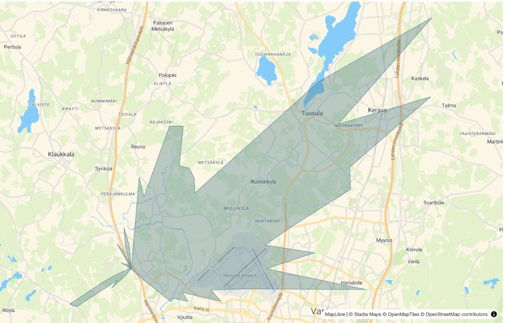
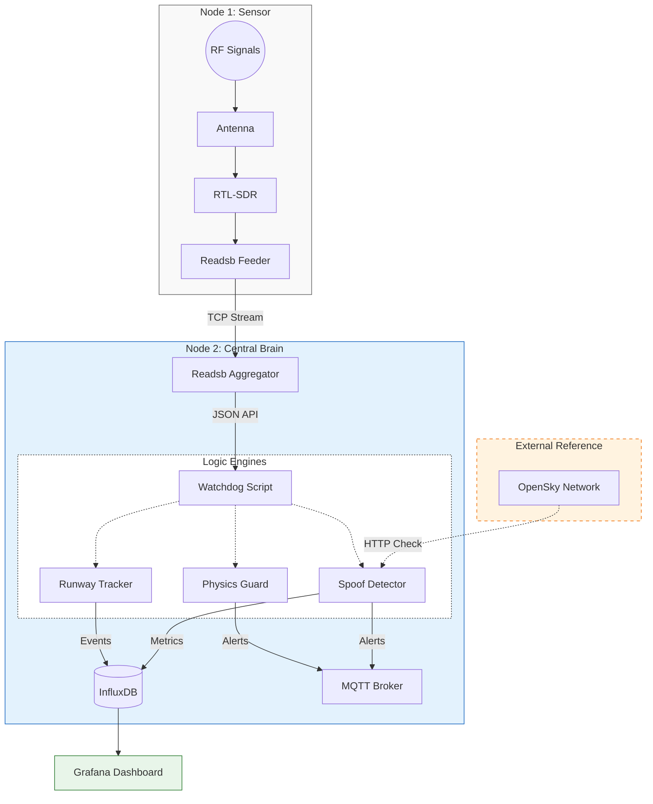

# Secure Skies: ADS-B Integrity & Spoofing Detection


[](LICENSE)


**Location:** HEL-ARN Corridor (Focus: EFHK)  
**Author:** RW

## 📖 Project Overview
**Business Problem:** Unencrypted ADS-B signals are vulnerable to spoofing, creating "ghost flights" and polluting data streams used for air traffic monitoring and critical safety systems.

**Goal:** Detect flight anomalies in real-time by comparing local RF data against global reference networks and analyzing kinematic physics (e.g., impossible turns, fake go-arounds).

---

## 🔭 Hardware Architecture
This project uses a distributed **"Sensor & Brain"** topology to isolate sensitive RF reception from heavy AI processing.

### 📡 Node 1: The Sensor (RPi 4)
* **IP:** 192.168.1.152
* **Role:** Dedicated Signal Capture (SIGINT).
* **Hardware:** Raspberry Pi 4 + [RTL-SDR V3 Dongle](https://www.rtl-sdr.com/about-rtl-sdr/) + 1090MHz Antenna.
* **Placement:** **11th Floor** window facing Helsinki-Vantaa (EFHK).
* **Function:** Decodes raw 1090MHz RF signals into Beast binary format and streams it over TCP. No local processing to minimize noise.

### 🧠 Node 2: The Central Brain (RPi 5)
* **IP:** 192.168.1.134
* **Role:** Aggregation, Logic & AI.
* **Hardware:** Raspberry Pi 5 (16GB RAM) + 1TB NVMe.
* **Function:**
    * Ingests stream from Node 1.
    * Runs **Watchdog 2.0** (Anomaly Detection).
    * Hosts InfluxDB (Time-series data) and Grafana (Visualization).
    * Detects "Ghost Planes" via OpenSky Network cross-referencing.

---

## 🗺️ Receiver Coverage



*Source: [PlaneFinder Receiver 235846](https://planefinder.net/coverage/receiver/235846)*

This map plots the range of the receiver. The dotted lines represent the theoretical maximum distance the receiver should be able to spot aircraft flying at 10k and 40k feet taking into account obstructions from terrain.

---

## 🌐 Global Coverage & Validation
This sensor node contributes data to global networks, allowing us to validate our local findings against community data.

| Network | Station ID | Status |
| :--- | :--- | :--- |
| **AirNav Radar** | [EXTRPI688862](https://www.airnavradar.com/stations/EXTRPI688862) | 🟢 Active |
| **PlaneFinder** | [Receiver 235846](https://planefinder.net/coverage/receiver/235846) | 🟢 Active |
| **FlightAware** | [User: rwiren2](https://www.flightaware.com/adsb/stats/user/rwiren2) | 🟢 Active |
| **FlightRadar24** | [Feed ID: 72235](https://www.flightradar24.com/account/feed-stats/?id=72235) | 🟢 Active |

---

## 📐 System Data Flow



---

## 🛡️ Security Modules (Watchdog 2.0)

The core logic is handled by the ```spoof-detector``` container, which runs three parallel threads:

1.  **Runway Logic:**
    * Detects if a plane is aligned with EFHK runways (22L/04R, 22R/04L, 15/33).
    * Identifies **Go-Arounds** (Low altitude + High positive vertical rate).
    * Identifies **Rejected Takeoffs** (High speed on ground -> Zero speed).

2.  **Spoof Detection:**
    * **Distance Check:** Compares local RPi4 signal position vs. OpenSky Network global position.
    * **Threshold:** If discrepancy > 2.0 km, the target is flagged as a potential spoofer.

3.  **Physics Guard:**
    * Monitors for "Impossible Kinematics" (e.g., speed > 1,225 km/h ([Mach 1](https://en.wikipedia.org/wiki/Mach_number))).

---

## 📂 Repository Structure
```text
.
├── coverage-map.jpg            # Coverage visualization
├── docker-compose.yml          # Service Orchestration
├── spoof-detector              # Watchdog 2.0 (The Brain)
│   ├── Dockerfile
│   ├── requirements.txt
│   └── watchdog.py             # Main Logic (Threaded)
├── physics-guard               # (Legacy) Standalone Physics Module
│   └── guard.py
└── runway-tracker              # (Legacy) Standalone ML Labeler
    └── src/
```

---

## 🛠 Deployment

```bash
# 1. Clone the repo
git clone [https://github.com/rwiren/central-brain.git](https://github.com/rwiren/central-brain.git)

# 2. Set Env Variables in Balena Dashboard
# LAT, LON, OPENSKY_USER, OPENSKY_PASS

# 3. Deploy
balena push central
```

## License
This project is licensed under the MIT License - see the [LICENSE](LICENSE) file for details.
