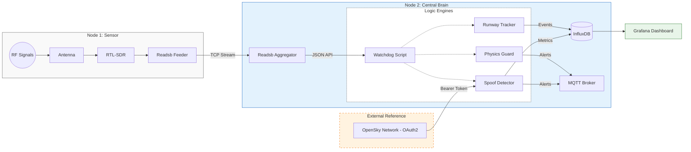

# Secure Skies: ADS-B Integrity & Spoofing Detection


[](LICENSE)


**Location:** HEL-ARN Corridor (Focus: EFHK)  
**Author:** RW

---

### 📋 Table of Contents
- [Project Overview](#-project-overview)
- [Hardware Architecture](#-hardware-architecture)
- [System Data Flow](#-system-data-flow)
- [Security Modules](#-security-modules-watchdog-20)
- [Data Schema (InfluxDB)](#-data-schema-influxdb)
- [Receiver Coverage](#-receiver-coverage)
- [Deployment](#-deployment)

---

## 📖 Project Overview
**Business Problem:** Unencrypted ADS-B signals are vulnerable to spoofing, creating "ghost flights" and polluting data streams used for air traffic monitoring and critical safety systems.

**Goal:** Detect flight anomalies in real-time by comparing local RF data against global reference networks (OpenSky) and analyzing kinematic physics (e.g., impossible turns, fake go-arounds).

---

## 🔭 Hardware Architecture
This project uses a distributed **"Sensor & Brain"** topology to isolate sensitive RF reception from heavy AI processing.

### 📡 Node 1: The Sensor (RPi 4)
* **Role:** Dedicated Signal Capture and JSON Server.
* **Hardware:** Raspberry Pi 4 + [RTL-SDR V3 Dongle](https://www.rtl-sdr.com/about-rtl-sdr/) + 1090MHz Antenna.
* **Placement:** **11th Floor** window facing Helsinki-Vantaa (EFHK).
* **Function:** Decodes raw 1090MHz RF signals into Beast binary format and serves the processed data via HTTP.

### 🧠 Node 2: The Central Brain (RPi 5)
* **Role:** Aggregation, Logic, Analytics & OAuth2 Handler.
* **Hardware:** Raspberry Pi 5 (16GB RAM) + 1TB NVMe.
* **Function:**
    * Ingests Beast stream from Node 1.
    * Runs **Watchdog 2.0** (Anomaly Detection).
    * Hosts InfluxDB (Time-series data) and Grafana (Visualization).
    * **OAuth2 Integration:** Implements the [OAuth2 Client Credentials Flow](https://openskynetwork.github.io/opensky-api/rest.html#oauth2-client-credentials-flow) to reliably fetch global truth data from OpenSky.

---

## 📐 System Data Flow



---

## 🛡️ Security Modules (Watchdog 2.0)

The core logic is handled by the `spoof-detector` container. It ingests real-time data from `adsb-feeders`, performs cross-verification in parallel threads, and writes the results to the `integrity_check` and `flight_ops` measurements.

1. **Runway Logic (Geofencing)**
   * **Goal:** Distinguish legitimate landings from low-altitude flyovers using vector geometry.
   * **Reference:** [EFHK Aerodrome Chart (AIS Finland)](https://www.ais.fi/eaip/005-2025_2025_10_02/documents/Root_WePub/ANSFI/Charts/AD/EFHK/EF_AD_2_EFHK_MARK.pdf)
   * **Logic:** Detects alignment with runways **22L/04R**, **22R/04L**, and **15/33**.
   * **Output:** Enriches the `flight_ops` measurement with spatial data (`distance_km`, `bearing_deg`).

2. **Spoof Detection (Primary)**
   * **Function:** Cross-references the Local RPi sensor (`local_aircraft_state`) against the OpenSky Network "truth" (`global_aircraft_state`).
   * **Logic:** Calculates the Euclidean distance deviation (`lat_error`, `lon_error`).
   * **Threshold:** If the discrepancy > **2.0 km**, the `is_spoofed` flag is set to `1` in the `integrity_check` measurement.

3. **Physics Guard**
   * **Function:** Filters out synthetic "ghost" data that violates airframe physics.
   * **Logic:** Monitors `gs_knots` and `v_rate_fpm` in `local_aircraft_state` for impossible kinematics.
   * **Threshold:** Flags values exceeding civilian traffic capabilities (e.g., > 1,225 km/h or [Mach 1](https://en.wikipedia.org/wiki/Mach_number)) and increments the `event_score`.

---

## 📘 Data Schema (InfluxDB)

All time-series data is stored in the `readsb` database. The measurements are categorized into three groups: **Tracking Data** (for comparison), **Analysis & Detection** (for spoofing logic), and **System Health**.

### 1. Tracking Data (Comparison Sources)
These measurements provide the raw position data used for comparison. Note the unit differences between Local (Imperial standard) and Global (Metric standard) sources.

#### ✈️ Measurement: `local_aircraft_state`
*Stores real-time, validated aircraft position and kinematic data directly from the local RPi4 sensor.*

| Field Key | Type | Description |
| :--- | :--- | :--- |
| `lat`, `lon` | Float | Aircraft Position (WGS84). |
| `alt_baro_ft` | Integer | Barometric Altitude (**Feet**). |
| `gs_knots` | Float | Ground Speed (**Knots**). |
| `v_rate_fpm` | Integer | Vertical Rate (**ft/min**). |
| `track` | Float | True track over ground (degrees). |
| `origin_data` | String | Source tag (e.g., `"LocalReadsb"`). |

#### 🌍 Measurement: `global_aircraft_state`
*Stores external, global "truth" position data fetched via the OpenSky Network API.*

| Field Key | Type | Description |
| :--- | :--- | :--- |
| `lat`, `lon` | Float | Aircraft Position (WGS84). |
| `baro_alt_m` | Float | Barometric Altitude (**Meters**). |
| `gs_mps` | Float | Ground Speed (**Meters/sec**). |
| `vr_mps` | Float | Vertical Rate (**Meters/sec**). |
| `origin_data` | String | Source tag (e.g., `"OpenSky"`). |

---

### 2. Analysis & Spoofing Detection
These measurements are generated by the comparison logic to detect anomalies and calculate risk scores.

#### 🛡️ Measurement: `integrity_check`
*Stores the calculated deviations between Local and Global data points.*

| Field Key | Type | Description |
| :--- | :--- | :--- |
| `is_spoofed` | Integer | Binary flag (0 = Normal, 1 = Potential Spoofing). |
| `lat_error` | Float | Deviation in Latitude between sensors. |
| `lon_error` | Float | Deviation in Longitude between sensors. |

#### 🚨 Measurement: `flight_ops`
*Operational metrics and risk scoring for specific flight events.*

| Field Key | Type | Description |
| :--- | :--- | :--- |
| `is_spoofed` | Integer | Spoofing detected flag. |
| `event_score` | Integer | Calculated risk score for the event. |
| `distance_km` | Float | Distance from receiver. |
| `bearing_deg` | Float | Bearing from receiver. |
| `speed_kts` | Integer | Standardized speed in Knots. |
| `vertical_rate` | Integer | Standardized vertical rate. |

---

### 3. System Health & Statistics
Metrics regarding the performance of the hardware, signal reception, and the decoding software.

#### 📊 Measurement: `local_performance`
*General health and signal metrics of the local receiver.*

| Field Key | Type | Description |
| :--- | :--- | :--- |
| `messages` | Integer | Message rate per interval. |
| `signal_db` | Float | Average signal strength (RSSI). |
| `cpu_sec` | Float | CPU time consumed by the decoder. |
| `strong_signals` | Integer | Count of signals exceeding reference thresholds. |
| `airborne_msg` | Integer | Count of airborne position messages decoded. |

#### ⚙️ Measurement: `readsb`
*Deep internal metrics from the readsb decoder engine.*

| Field Key | Type | Description |
| :--- | :--- | :--- |
| `cpr_*` | Float | Compact Position Reporting stats (airborne, surface, skipped, etc.). |
| `remote_*` | Float | Remote feed stats (modes, modeac, accepted, etc.). |
| `tracks_*` | Float | Tracking logic stats (new, single_message, with_position). |
| `cpu_background`| Float | CPU usage for background maintenance tasks. |

#### 📈 Measurement: `global_truth` / `local_stats`
*Simple counters used for dashboard aggregations.*

| Field Key | Type | Description |
| :--- | :--- | :--- |
| `aircraft_count`| Integer | Number of unique aircraft currently tracked by the specific source. |

---

### ⚠️ Legacy Note
**Measurement: `aircraft`**
This measurement contains raw field dumps (e.g., `Trak`, `Spd`, `Sig`, `GAlt`). For analysis and dashboards, it is recommended to use `local_aircraft_state` as field names are normalized and consistent.

## 🗺️ Receiver Coverage


*Source: [PlaneFinder Receiver 235846](https://planefinder.net/coverage/receiver/235846)*

The dotted lines represent the theoretical maximum distance the receiver should be able to spot aircraft flying at 10k and 40k feet taking into account obstructions from terrain.

### 🌐 Global Validation
This sensor node contributes data to global networks, allowing us to validate our local findings against community data.

| Network | Station ID | Status |
| :--- | :--- | :--- |
| **AirNav Radar** | [EXTRPI688862](https://www.airnavradar.com/stations/EXTRPI688862) | 🟢 Active |
| **PlaneFinder** | [Receiver 235846](https://planefinder.net/coverage/receiver/235846) | 🟢 Active |
| **FlightAware** | [User: rwiren2](https://www.flightaware.com/adsb/stats/user/rwiren2) | 🟢 Active |
| **FlightRadar24** | [Feed ID: 72235](https://www.flightradar24.com/account/feed-stats/?id=72235) | 🟢 Active |

---

## 📂 Repository Structure

```text
.
├── DATA_DICTIONARY.md     # Deprecated, content merged into README.md
├── LICENSE
├── README.md
├── adsb-feeders/          # NEW: Handles data ingestion to InfluxDB (Local & OpenSky)
│   ├── Dockerfile
│   ├── opensky_feeder.py
│   ├── readsb_feeder.py
│   └── readsb_position_feeder.py
├── assets/
├── docker-compose.yml
├── physics-guard/         # Original Logic (now integrated into spoof-detector)
├── runway-tracker/        # Original Logic (now integrated into spoof-detector)
└── spoof-detector/        # Watchdog 2.0 (Main Analyzer)
```

---

## 📚 Acknowledgements & References
* **Base Infrastructure:** [balena-ads-b by ketilmo](https://github.com/balena-io/balena-ads-b)
* **Data Validation:** [OpenSky Network Config](https://www.opensky-network.org/my-info/api)
* **Hardware:** [RTL-SDR.com](https://www.rtl-sdr.com/)
* **Security Research:** [Defeating ADS-B (YouTube)](https://www.youtube.com/watch?v=51zEjso9kZw)

---

## 🛠 Deployment

1.  **Set Environment Variables (.env file and Balena Dashboard):** You must define these variables for the deployment process.
    * **Variables:** `LAT`, `LON`, `INFLUX_USER`, `INFLUX_PASSWORD`, `GRAFANA_PASSWORD`
    * **OAuth2 Credentials:** `OPENSKY_CLIENT_ID` and `OPENSKY_CLIENT_SECRET` (Mandatory for API access).

2.  **Deployment:** Push the current repository to your Balena application.

```bash

balena push <your fleet name>

```

## License
This project is licensed under the MIT License - see the [LICENSE](LICENSE) file for details.
