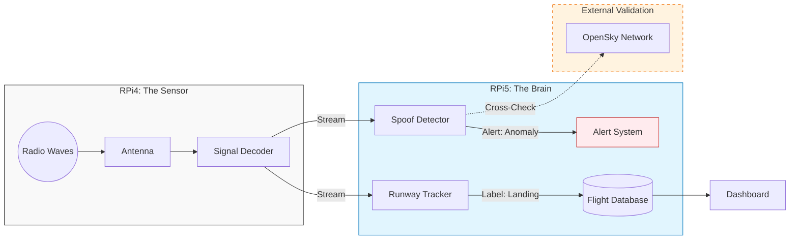

# Secure Skies: ADS-B Integrity & Spoofing Detection


**Location:** HEL-ARN Corridor (Focus: EFHK)
**Author:** RW

## 📖 Project Overview
**Business Problem:** Unencrypted ADS-B signals are vulnerable to spoofing, creating "ghost flights" and polluting data streams used for Integrated Sensing (ISAC).

**Goal:** Train a Sequence Model (LSTM/RNN) to predict flight anomalies by learning the physics of valid trajectories vs. synthetic spoofing attacks.

---

## 📐 System Flow
This architecture treats the RPi4 as a "dumb" sensor (Forward Edge) and the RPi5 as the "intelligent" processor (Central Brain).



---

## 📂 Repository Structure
```text
.
├── docker-compose.yml          # Orchestration
├── physics-guard               # Logic: Detects Mach 2 anomalies
│   ├── Dockerfile
│   ├── guard.py
│   └── requirements.txt
├── runway-tracker              # Logic: Geofencing & ML Labeling
│   ├── Dockerfile
│   └── src
│       └── main.py
└── spoof-detector              # Logic: OpenSky Cross-referencing
    ├── Dockerfile
    ├── requirements.txt
    └── watchdog.py
```

---

## 📔 Project Journal

### [2025-11-23] Phase 1: Infrastructure & Data Engineering
- **Objective:** Establish reliable data collection for HEL flight corridor.
- **Action:** Deployed `readsb` (SDR), `influxdb` (Time-Series DB), and `grafana`.
- **Feature Engineering:** Implemented `runway-tracker` service to calculate distance-to-threshold and vertical rates.
- **Data:** Successfully logging ~10,000 flight events per day to `flight_ops` bucket.

---

## 📚 Acknowledgements & References
This project builds upon open-source research and existing Balena blocks.

* **Base Infrastructure:** [balena-ads-b by ketilmo](https://github.com/ketilmo/balena-ads-b?tab=readme-ov-file) - Excellent foundation for containerized SDR.
* **Data Validation:** [OpenSky Network Config](https://github.com/ketilmo/balena-ads-b?tab=readme-ov-file#part-6--configure-opensky-network) - We utilize their API for ground-truth verification.
* **Security Research:** [Defeating ADS-B (YouTube)](https://www.youtube.com/watch?v=51zEjso9kZw)

---

## 🛠 Deployment
```bash
balena push <app-name>
```
