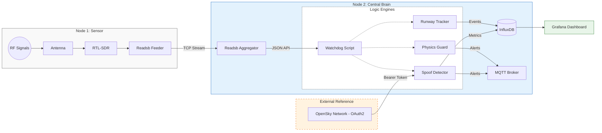
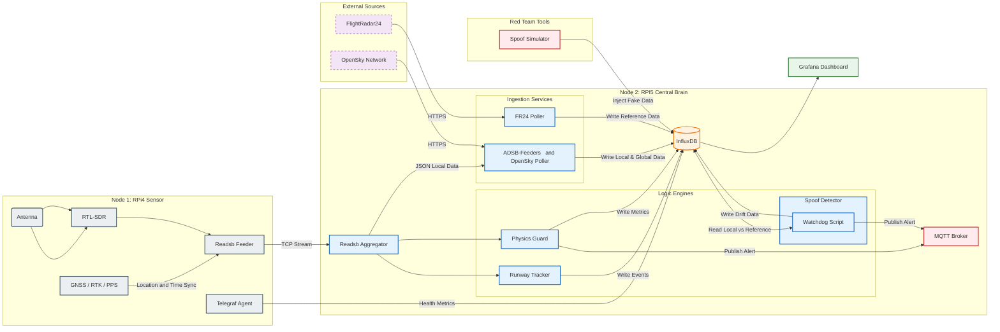

# Secure Skies: ADS-B Integrity & Spoofing Detection


[](LICENSE)


[](https://github.com/rwiren/central-brain/wiki)


**Location:** HEL-ARN Corridor (Focus: EFHK)  
**Author:** RW

---

### 📋 Table of Contents
- [Project Overview](#-project-overview)
- [Hardware Architecture](#-hardware-architecture)
- [System Data Flow](#-system-data-flow)
- [Security Modules](#-security-modules-watchdog-20)
- [Data Schema (InfluxDB)](#-data-schema-influxdb)
- [Grafana Dashboards](#-grafana-dashboards)
- [MLAT / TDoA Verification](#mlat)
- [Receiver Coverage](#-receiver-coverage)
- [Repository Structure](#structure)
- [Acknowledgements & References](#acknowledgements)
- [Deployment](#-deployment)

---

## 📖 Project Overview
**Business Problem:** Unencrypted ADS-B signals are vulnerable to spoofing, creating "ghost flights" and polluting data streams used for air traffic monitoring and critical safety systems.

**Goal:** Detect flight anomalies in real-time by comparing local RF data against global reference networks (OpenSky) and analyzing kinematic physics (e.g., impossible turns, fake go-arounds).

---

## 🔭 Hardware Architecture
This project uses a distributed **"Sensor & Brain"** topology to isolate sensitive RF reception from heavy AI processing.

### 📡 Node 1: The Sensor (and "The Anchor") (RPi 4)
* **Location:** HEL-ARN Corridor (Focus: EFHK)
* **Role:** Dedicated Signal Capture and JSON Server. Primary sync node for the MLAT "Truth Box."
* **Hardware:** Raspberry Pi 4 + [RTL-SDR V3 Dongle](https://www.rtl-sdr.com/about-rtl-sdr/) + 1090MHz Antenna.
* **Placement:** High Floor window with clear Line of Sight (LoS) facing Helsinki-Vantaa.
* **Function:** Decodes raw 1090MHz RF signals into Beast binary format and serves the processed data via HTTP.

### 🧠 Node 2: The Central Brain (RPi 5)
* **Role:** Aggregation, Logic, Analytics & OAuth2 Handler.
* **Hardware:** Raspberry Pi 5 (16GB RAM) + 1TB NVMe.
* **Function:**
    * Ingests Beast stream from Node 1.
    * Runs **Watchdog 2.0** (Anomaly Detection).
    * Hosts InfluxDB (Time-series data) and Grafana (Visualization).
    * **OAuth2 Integration:** Implements the [OAuth2 Client Credentials Flow](https://openskynetwork.github.io/opensky-api/rest.html#oauth2-client-credentials-flow) to reliably fetch global truth data from OpenSky.

* **[Complete Hardware Guide](https://github.com/rwiren/central-brain/wiki/Hardware-Setup)**
  
---

## 📐 System Data Flow

### Simple diagram
[View simple diagram](https://raw.githubusercontent.com/rwiren/central-brain/main/assets/mermaid_simple_diagram.png)




### More complex diagram
[View more complex diagram](https://raw.githubusercontent.com/rwiren/central-brain/main/assets/mermaid_complex_diagram-2.png)



This diagram illustrates the data lifecycle within the ecosystem, detailing how raw RF signals are transformed into actionable security intelligence across a distributed multi-node architecture.

**1. The Sensing Layer (Node 1: RPi4 Sensor)**
The remote physical interface responsible for signal acquisition.
* **Signal Path:** Captures 1090MHz signals via Antenna/RTL-SDR and decodes them into structured aircraft messages (`Readsb Feeder`).
* **Precision Timing:** Utilizes a **GNSS / RTK** module for high-precision PPS (Pulse Per Second) timing, essential for multilateration.
* **Health:** A `Telegraf Agent` sidecar pushes hardware telemetry (CPU/Temp) downstream.

**2. The Central Brain (Node 2: RPi5 Server)**
The core processing unit for data fusion and analysis.
* **Ingestion:** Aggregates raw TCP streams from sensors and enriches them with global "Truth Data" fetched from **FlightRadar24** and **OpenSky Network**.
* **Data Lake (InfluxDB):** The central hub storing all local positions, global references, system health, and alerts for real-time querying.
* **Logic Engines:** Independent microservices analyzing the stream:
    * **Physics Guard:** Flags impossible maneuvers (e.g., Mach > 0.95).
    * **Runway Tracker:** Geofences aircraft to detect landing/takeoff events.
    * **Spoof Detector:** Compares *Local* vs. *Truth* data; triggers alerts if drift > 2km.

**3. The Action Layer**
* **Output:** **Grafana** renders the [Command Dashboard](https://github.com/rwiren/central-brain/wiki/Grafana-Dashboards) while critical alerts are published to **MQTT**.
* **Red Team:** The **Spoof Simulator** validates defense logic by injecting synthetic attack vectors into the datastore.


---

## 🛡️ Security Modules (Watchdog 2.0)

The core logic is handled by the `spoof-detector` container. It ingests real-time data from `adsb-feeders`, performs cross-verification in parallel threads, and writes the results to the `integrity_check` and `flight_ops` measurements.

1. **Runway Logic (Geofencing)**
   * **Goal:** Distinguish legitimate landings from low-altitude flyovers using vector geometry.
   * **Reference:** [EFHK Aerodrome Chart (AIS Finland)](https://www.ais.fi/eaip/005-2025_2025_10_02/documents/Root_WePub/ANSFI/Charts/AD/EFHK/EF_AD_2_EFHK_MARK.pdf)
   * **Logic:** Detects alignment with runways **22L/04R**, **22R/04L**, and **15/33**.
   * **Output:** Enriches the `flight_ops` measurement with spatial data (`distance_km`, `bearing_deg`).

2. **Spoof Detection (Primary)**
   * **Function:** Cross-references the Local RPi sensor (`local_aircraft_state`) against the OpenSky Network "truth" (`global_aircraft_state`).
   * **Logic:** Calculates the Euclidean distance deviation (`lat_error`, `lon_error`).
   * **Threshold:** If the discrepancy > **2.0 km**, the `is_spoofed` flag is set to `1` in the `integrity_check` measurement.

3. **Physics Guard**
   * **Function:** Filters out synthetic "ghost" data that violates airframe physics.
   * **Logic:** Monitors `gs_knots` and `v_rate_fpm` in `local_aircraft_state` for impossible kinematics.
   * **Threshold:** Flags values exceeding civilian traffic capabilities (e.g., > 1,225 km/h or [Mach 1](https://en.wikipedia.org/wiki/Mach_number)) and increments the `event_score`.
  

4. **Simulation Tools:** [Red Team Suite](https://github.com/rwiren/central-brain/wiki//Tools:-Red-Team-Suite)

---

## 📘 Data Schema (InfluxDB)

The system stores real-time flight telemetry in the `readsb` database. While the full schema handles over 30 distinct data points, we focus on two primary categories for detection: **Integrity** and **Performance**.

### 🗝️ Key Metrics Snapshot

**1. The "Hunter" Metrics (Security)**
*Used to detect anomalies, spoofing, and impossible flight maneuvers.*

| Measurement | Key Field | Description |
| :--- | :--- | :--- |
| `integrity_check` | **`is_spoofed`** | Binary Alert (`1` = Spoofed). Triggered when `lat_error` > 2.0km. |
| `integrity_check` | `lat_error` | The calculated distance (km) between the local signal and global truth. |
| `flight_ops` | **`event_score`** | Risk accumulator. Increases when physics rules (Mach 1, Vertical Rate) are broken. |

**2. The "Sensor" Metrics (Hardware)**
*Used to monitor the health of the RTL-SDR receiver.*

| Measurement | Key Field | Description |
| :--- | :--- | :--- |
| `local_performance` | **`signal_db`** | Signal Strength (RSSI). Monitor this for antenna degradation or jamming. |
| `local_performance` | `strong_signals` | Count of signals saturating the receiver (Gain too high). |
| `local_performance` | `messages` | Total message rate (Traffic volume). |

---

📚 **Full Documentation on Wiki**

For the complete data dictionary, including **Unit Conversions** (Knots vs m/s), **Data Types**, and **Sample InfluxQL Queries**, check the Wiki:

**👉 [View the Data Schema Reference](https://github.com/rwiren/central-brain/wiki/Data-Schema)**

---

### <a name="-grafana-dashboards"></a>📊 Grafana Dashboards

Visualization of real-time flight telemetry, spoofing alerts, and system health.

* **[Command Center Configuration](https://github.com/rwiren/central-brain/wiki/Grafana-Dashboards)**: Detailed documentation of the InfluxQL queries, panel settings, and visual logic used in the dashboard.

### Core Views
* **Live Tactical Map:** Visualizes aircraft positions, headings, and altitude heatmaps using a dark-mode geospatial overlay.
* **Signal Integrity:** Monitors the "Pulse" of the system by tracking message rate volume (`messages/sec`) versus active target quality.
* **Spoofing Alert Heatmap:** *(In Progress)* Visualizing `is_spoofed` events geographically to identify denial-of-service zones.
* **Drift Analysis:** *(In Progress)* Plotting the delta between `local_aircraft_state` and `global_truth` (OpenSky) over time.

---
### <a name="mlat"></a>📡 MLAT / TDoA Verification (The "Lie Detector")
**Status:** 🚧 In Development | **Goal:** Spoofing Detection

We are implementing a **Multilateration (MLAT)** engine to act as a physics-based "Truth Source" alongside OpenSky data.

* **The Problem:** GPS Spoofing allows an actor to broadcast fake coordinates—for example, claiming to be an airliner on final approach to **Helsinki-Vantaa (HEL)**, when they are actually transmitting from a vehicle parked on the ground nearby.
* **The Solution:** By measuring the precise **Time Difference of Arrival (TDoA)** of the signal at 4+ synchronized receivers, we calculate the signal's origin purely using geometry and the speed of light.
* **The Trap:** If `Calculated_Position` (MLAT) ≠ `Reported_Position` (ADS-B), the system flags a **Critical Security Anomaly**.

👉 **[Read the Technical Breakdown (Wiki)](https://github.com/rwiren/central-brain/wiki/MLAT-Verification)**
<br>
🛠️ **[Try the Network Planner Tool (Wiki)](https://github.com/rwiren/central-brain/wiki/Tools:-Network-Planner)**
<br>
🧮 **[TEST THE 3D SOLVER ENGINE (Live Simulation)](https://colab.research.google.com/github/rwiren/central-brain/blob/main/tools/mlat_physics_engine.ipynb)** <-- NEW !

---

## 🗺️ Receiver Coverage


*Source: [PlaneFinder Receiver 235846](https://planefinder.net/coverage/receiver/235846)*

The dotted lines represent the theoretical maximum distance the receiver should be able to spot aircraft flying at 10k and 40k feet taking into account obstructions from terrain.

### 🌐 Global Validation
This sensor node contributes data to global networks, allowing us to validate our local findings against community data.

| Network | Station ID | Status |
| :--- | :--- | :--- |
| **AirNav Radar** | [EXTRPI688862](https://www.airnavradar.com/stations/EXTRPI688862) | 🟢 Active |
| **PlaneFinder** | [Receiver 235846](https://planefinder.net/coverage/receiver/235846) | 🟢 Active |
| **FlightAware** | [User: rwiren2](https://www.flightaware.com/adsb/stats/user/rwiren2) | 🟢 Active |
| **FlightRadar24** | [Feed ID: 72235](https://www.flightradar24.com/account/feed-stats/?id=72235) | 🟢 Active |

---

## <a name="structure"></a>📂 Repository Structure

```text
.
├── DATA_DICTIONARY.md         # Deprecated (See Wiki for active schema)
├── LICENSE
├── README.md                  # Project documentation & quick start
├── docker-compose.yml         # Main orchestration stack
├── adsb-feeders/              # Ingestion Pipelines (Local & OpenSky -> InfluxDB)
│   ├── Dockerfile
│   ├── opensky_feeder.py
│   ├── readsb_feeder.py
│   └── readsb_position_feeder.py
├── spoof-detector/            # CORE: Watchdog 2.0 (Main Security Analyzer)
│   ├── Dockerfile
│   └── watchdog.py
├── tools/                     # Utilities & Planning
│   ├── mlat_solver.py         # Core-4 Math Engine (Physics Solver)
│   ├── mlat_planner.ipynb     # Interactive Colab Notebook (for Wiki)
│   ├── mlat_planner.py        # Local Python script for visualization
│   └── generate_notebook.py   # Helper to build the notebook
├── assets/                    # Documentation images & MLAT diagrams
├── physics-guard/             # [Legacy] Original logic (integrated into spoof-detector)
└── runway-tracker/            # [Legacy] Original logic (integrated into spoof-detector)
```

---

## <a name="acknowledgements"></a>📚 Acknowledgements & References
* **Base Infrastructure:** [balena-ads-b](https://hub.balena.io/apps/1829313/balena-ads-b)
* **Data Validation:** [OpenSky Network Config](https://www.opensky-network.org/my-info/api)
* **Hardware:** [RTL-SDR.com](https://www.rtl-sdr.com/)
* **Security Research:** [Defeating ADS-B (YouTube)](https://www.youtube.com/watch?v=51zEjso9kZw)

---

## 🛠 Deployment

1.  **Set Environment Variables (.env file and Balena Dashboard):** You must define these variables for the deployment process.
    * **Variables:** `LAT`, `LON`, `INFLUX_USER`, `INFLUX_PASSWORD`, `GRAFANA_PASSWORD`, `FR24_API_TOKEN`
    * **OAuth2 Credentials:** `OPENSKY_CLIENT_ID` and `OPENSKY_CLIENT_SECRET` (Mandatory for API access).

2.  **Deployment:** Push the current repository to your Balena application.

```bash

balena push <your fleet name>

```

## License
This project is licensed under the MIT License - see the [LICENSE](LICENSE) file for details.
