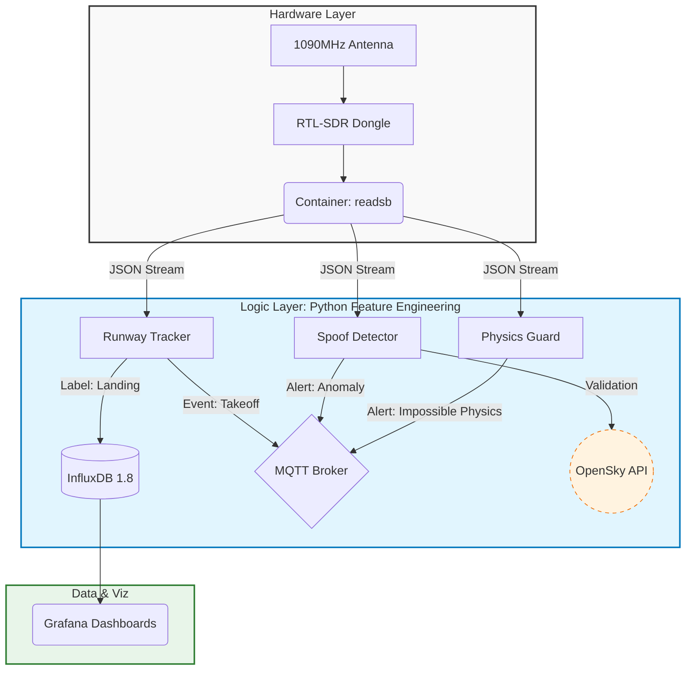

# Secure Skies: ADS-B Integrity & Spoofing Detection


**Location:** HEL-ARN Corridor (Focus: EFHK)
**Author:** RW

## 📖 Project Overview
**Business Problem:** Unencrypted ADS-B signals are vulnerable to spoofing, creating "ghost flights" and polluting data streams used for Integrated Sensing (ISAC).

**Goal:** Train a Sequence Model (LSTM/RNN) to predict flight anomalies by learning the physics of valid trajectories vs. synthetic spoofing attacks.

---

## 📐 System Architecture

This project utilizes a distributed edge architecture. The **RPi4** acts as the forward-deployed SIGINT sensor (RF capture), while the **RPi5** serves as the "Central Brain" for heavy data processing, ML feature engineering, and storage.



---

## 📂 Repository Structure
```text
.
├── docker-compose.yml          # Orchestration for RPi5 Central Brain
├── physics-guard               # Logic: Detects Mach 2 anomalies
│   ├── Dockerfile
│   ├── guard.py
│   └── requirements.txt
├── runway-tracker              # Logic: Geofencing & ML Labeling
│   ├── Dockerfile
│   └── src
│       └── main.py
└── spoof-detector              # Logic: OpenSky Cross-referencing
    ├── Dockerfile
    ├── requirements.txt
    └── watchdog.py
```

---

## 🏗 Modular Functions

1.  **Ingestion (SIGINT):** Captures raw 1090MHz RF data via `readsb`.
2.  **Labeling (Runway Tracker):** A physics engine that tags flights as "Landing" or "Takeoff" based on precise runway threshold logic. This generates the **Ground Truth** labels for the ML model.
3.  **Validation (Spoof Detector):** Compares local RF data against global OpenSky Network data to detect inconsistencies.

---

## 📔 Project Journal

### [2025-11-23] Phase 1: Infrastructure & Data Engineering
- **Objective:** Establish reliable data collection for HEL flight corridor.
- **Action:** Deployed `readsb` (SDR), `influxdb` (Time-Series DB), and `grafana`.
- **Feature Engineering:** Implemented `runway-tracker` service to calculate distance-to-threshold and vertical rates.
- **Data:** Successfully logging ~10,000 flight events per day to `flight_ops` bucket.

---

## 📚 Inspiration & References
This project builds upon research into air traffic security and sensor fusion.
* **ADS-B Security Vulnerabilities:** [YouTube: Defeating ADS-B](https://www.youtube.com/watch?v=51zEjso9kZw)
* **OpenSky Network Research:** [Publications](https://opensky-network.org/about/publications)

---

## 🛠 Deployment
This project is designed for BalenaOS.

```bash
balena push <app-name>
```
