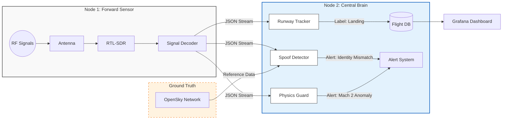

# Secure Skies: ADS-B Integrity & Spoofing Detection


**Location:** HEL-ARN Corridor (Focus: EFHK)
**Author:** RW

## 📖 Project Overview
**Business Problem:** Unencrypted ADS-B signals are vulnerable to spoofing, creating "ghost flights" and polluting data streams used for air traffic monitoring and critical safety systems.

**Goal:** Train a Sequence Model (LSTM/RNN) to predict flight anomalies by learning the physics of valid trajectories vs. synthetic spoofing attacks.

---

## 🔭 Hardware Setup
This project uses a distributed "Sensor & Brain" architecture to ensure maximum signal fidelity.

### 📡 Node 1: The Sensor (RPi 4)
* **Role:** Dedicated Signal Capture (SIGINT).
* **Hardware:** Raspberry Pi 4 + [RTL-SDR V3 Dongle](https://www.rtl-sdr.com/about-rtl-sdr/) + 1090MHz Antenna.
* **Placement:** **11th Floor** window facing Helsinki-Vantaa (EFHK).
* **Advantage:** High-altitude placement guarantees direct **Line-of-Sight (LoS)** to aircraft, resulting in high-quality, uninterrupted signal packets essential for training ML models.

### 🧠 Node 2: The Central Brain (RPi 5)
* **Role:** Compute, Logic & Storage.
* **Hardware:** Raspberry Pi 5 (16GB RAM) + 1TB NVMe + PoE + Hailo-8L AI Accelerator.
* **Advantage:** High-speed I/O allows for real-time physics calculations and database writes without dropping RF packets.

---

## 📐 System Data Flow



---

## 📂 Repository Structure
```text
.
├── docker-compose.yml          # Orchestration
├── physics-guard               # Logic: Detects kinematic anomalies (Speed > Mach 1)
│   ├── Dockerfile
│   ├── guard.py
│   └── requirements.txt
├── runway-tracker              # Logic: Geofencing & ML Labeling
│   ├── Dockerfile
│   └── src
│       └── main.py
└── spoof-detector              # Logic: OpenSky Cross-referencing
    ├── Dockerfile
    ├── requirements.txt
    └── watchdog.py
```

---

## 📔 Project Journal

### [2025-11-23] Phase 1: Infrastructure & Data Engineering
- **Objective:** Establish reliable data collection for HEL flight corridor.
- **Action:** Deployed `readsb` (SDR), `influxdb` (Time-Series DB), and `grafana`.
- **Feature Engineering:** Implemented `runway-tracker` service to calculate distance-to-threshold and vertical rates.
- **Data:** Successfully logging ~10,000 flight events per day to `flight_ops` bucket.

---

## 📚 Acknowledgements & References
This project builds upon open-source research and existing Balena blocks.

* **Base Infrastructure:** [balena-ads-b by ketilmo](https://github.com/ketilmo/balena-ads-b?tab=readme-ov-file) - Excellent foundation for containerized SDR.
* **Data Validation:** [OpenSky Network Config](https://github.com/ketilmo/balena-ads-b?tab=readme-ov-file#part-6--configure-opensky-network) - We utilize their API for ground-truth verification.
* **Hardware:** [RTL-SDR.com](https://www.rtl-sdr.com/) - The standard for low-cost radio analysis.
* **Security Research:** [Defeating ADS-B (YouTube)](https://www.youtube.com/watch?v=51zEjso9kZw)

---

## 🛠 Deployment
```bash
balena push <app-name>
```
