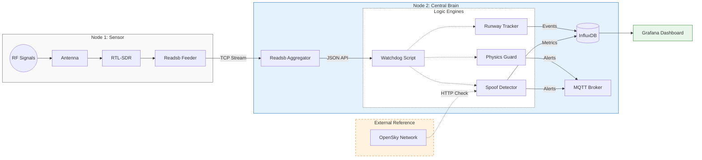

# Secure Skies: ADS-B Integrity & Spoofing Detection


[](LICENSE)


**Location:** HEL-ARN Corridor (Focus: EFHK)  
**Author:** RW

---

### 📋 Table of Contents
- [Project Overview](#-project-overview)
- [Hardware Architecture](#-hardware-architecture)
- [System Data Flow](#-system-data-flow)
- [Security Modules](#-security-modules-watchdog-20)
- [Receiver Coverage](#-receiver-coverage)
- [Data Dictionary & Schema](#-data-dictionary--system-architecture)
- [Deployment](#-deployment)

---

## 📖 Project Overview
**Business Problem:** Unencrypted ADS-B signals are vulnerable to spoofing, creating "ghost flights" and polluting data streams used for air traffic monitoring and critical safety systems.

**Goal:** Detect flight anomalies in real-time by comparing local RF data against global reference networks and analyzing kinematic physics (e.g., impossible turns, fake go-arounds).

---

## 🔭 Hardware Architecture
This project uses a distributed **"Sensor & Brain"** topology to isolate sensitive RF reception from heavy AI processing.

### 📡 Node 1: The Sensor (RPi 4)
* **Role:** Dedicated Signal Capture (SIGINT).
* **Hardware:** Raspberry Pi 4 + [RTL-SDR V3 Dongle](https://www.rtl-sdr.com/about-rtl-sdr/) + 1090MHz Antenna.
* **Placement:** **11th Floor** window facing Helsinki-Vantaa (EFHK).
* **Function:** Decodes raw 1090MHz RF signals into Beast binary format and streams it over TCP. No local processing to minimize noise.

### 🧠 Node 2: The Central Brain (RPi 5)
* **Role:** Aggregation, Logic & AI.
* **Hardware:** Raspberry Pi 5 (16GB RAM) + 1TB NVMe.
* **Function:**
    * Ingests stream from Node 1.
    * Runs **Watchdog 2.0** (Anomaly Detection).
    * Hosts InfluxDB (Time-series data) and Grafana (Visualization).
    * Detects "Ghost Planes" via OpenSky Network cross-referencing.

---

## 📐 System Data Flow



---

## 🛡️ Security Modules (Watchdog 2.0)

The core logic is handled by the ```spoof-detector``` container, which runs three parallel threads:

1.  **Runway Logic:**
    * **Goal:** Distinguish landings from low-altitude flyovers.
    * **Reference:** [EFHK Aerodrome Chart (AIS Finland)](https://www.ais.fi/eaip/005-2025_2025_10_02/documents/Root_WePub/ANSFI/Charts/AD/EFHK/EF_AD_2_EFHK_MARK.pdf)
    * **Logic:** Detects alignment with runways 22L/04R, 22R/04L, 15/33 based on vector geometry.

2.  **Spoof Detection:**
    * **Distance Check:** Compares local RPi4 signal position vs. OpenSky Network global position.
    * **Threshold:** If discrepancy > 2.0 km, the target is flagged as a potential spoofer.

3.  **Physics Guard:**
    * **Goal:** Filter out synthetic "ghost" data that violates physics.
    * **Thresholds:** Monitors for kinematics impossible for civilian traffic (e.g., a commercial jet or Cessna flying > 1,225 km/h ([Mach 1](https://en.wikipedia.org/wiki/Mach_number))).

---

## 🗺️ Receiver Coverage


*Source: [PlaneFinder Receiver 235846](https://planefinder.net/coverage/receiver/235846)*

The dotted lines represent the theoretical maximum distance the receiver should be able to spot aircraft flying at 10k and 40k feet taking into account obstructions from terrain.

### 🌐 Global Validation
This sensor node contributes data to global networks, allowing us to validate our local findings against community data.

| Network | Station ID | Status |
| :--- | :--- | :--- |
| **AirNav Radar** | [EXTRPI688862](https://www.airnavradar.com/stations/EXTRPI688862) | 🟢 Active |
| **PlaneFinder** | [Receiver 235846](https://planefinder.net/coverage/receiver/235846) | 🟢 Active |
| **FlightAware** | [User: rwiren2](https://www.flightaware.com/adsb/stats/user/rwiren2) | 🟢 Active |
| **FlightRadar24** | [Feed ID: 72235](https://www.flightradar24.com/account/feed-stats/?id=72235) | 🟢 Active |

---

## 📘 Data Dictionary & System Architecture

This section defines the data types, sources, and storage schemas used in the Central Brain.

### 1. Data Sources (Inputs)
* **Local Sensor Data:** Raw Beast Binary (Port 30005) from RPi4. Unencrypted ADS-B broadcasts (Mode S).
* **External Reference:** OpenSky Network API. Used to cross-reference local data and detect anomalies.

### 2. Database Schema (InfluxDB)
All time-series data is stored in the `readsb` database.

#### ✈️ Measurement: `flight_ops`
*Stores the processed logic and behavior analysis for each aircraft.*

| Field Key | Type | Description |
| :--- | :--- | :--- |
| **`lat`, `lon`** | Float | Aircraft Position (WGS84). |
| **`alt_ft`** | Integer | Barometric Altitude (Feet). |
| **`speed_kts`** | Integer | Ground Speed (Knots). |
| **`vertical_rate`** | Integer | Rate of Climb/Descent (ft/min). |
| **`bearing_deg`** | Float | Ground track (Heading). |
| **`distance_km`** | Float | Calculated distance from *your* sensor. |
| **`is_spoofed`** | Boolean | **1** = Anomaly detected (Mismatch/Physics violation). |
| **`event_score`** | Integer | Severity of the detected anomaly. |

#### 📡 Measurement: `readsb` (System Stats)
*Stores health metrics: `messages` (msg/sec), `tracks_with_position`, `cpu_background`.*

### 3. Alerting Data (MQTT)
Critical events (Spoofing, Go-Around) are published to `aviation/alerts`.

```json
{
  "type": "GO-AROUND",
  "timestamp": "2025-11-23T14:30:00Z",
  "details": "FIN123 at 22L (Alt: 1500ft, V-Rate: +2000fpm)"
}
```

---

## 📂 Repository Structure
```text
.
├── assets/                     # Images & diagrams
├── docker-compose.yml          # Service Orchestration
├── spoof-detector              # Watchdog 2.0 (The Brain)
│   ├── Dockerfile
│   ├── requirements.txt
│   └── watchdog.py             # Main Logic (Threaded)
├── physics-guard               # (Reference) Original standalone logic
│   └── guard.py
└── runway-tracker              # (Reference) Original standalone logic
    └── src/
```

---

## 📚 Acknowledgements & References
* **Base Infrastructure:** [balena-ads-b by ketilmo](https://github.com/ketilmo/balena-ads-b?tab=readme-ov-file)
* **Data Validation:** [OpenSky Network Config](https://github.com/ketilmo/balena-ads-b?tab=readme-ov-file#part-6--configure-opensky-network)
* **Hardware:** [RTL-SDR.com](https://www.rtl-sdr.com/)
* **Security Research:** [Defeating ADS-B (YouTube)](https://www.youtube.com/watch?v=51zEjso9kZw)

---

## 🛠 Deployment

```bash
# 1. Clone the repo
git clone [https://github.com/rwiren/central-brain.git](https://github.com/rwiren/central-brain.git)

# 2. Set Env Variables in Balena Dashboard
# LAT, LON, OPENSKY_USER, OPENSKY_PASS

# 3. Deploy
balena push central
```

## License
This project is licensed under the MIT License - see the [LICENSE](LICENSE) file for details.
