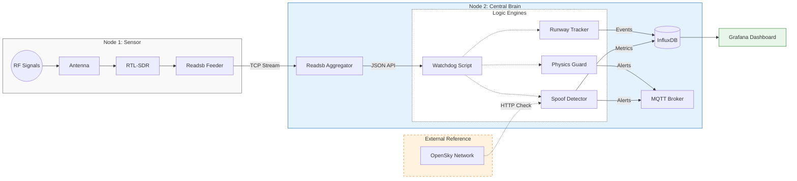

# Secure Skies: ADS-B Integrity & Spoofing Detection


[](LICENSE)


**Location:** HEL-ARN Corridor (Focus: EFHK)  
**Author:** RW

## 📖 Project Overview
**Business Problem:** Unencrypted ADS-B signals are vulnerable to spoofing, creating "ghost flights" and polluting data streams used for air traffic monitoring and critical safety systems.

**Goal:** Detect flight anomalies in real-time by comparing local RF data against global reference networks and analyzing kinematic physics (e.g., impossible turns, fake go-arounds).

---

## 🔭 Hardware Architecture
This project uses a distributed **"Sensor & Brain"** topology to isolate sensitive RF reception from heavy AI processing.

### 📡 Node 1: The Sensor (RPi 4)
* **Role:** Dedicated Signal Capture (SIGINT).
* **Hardware:** Raspberry Pi 4 + [RTL-SDR V3 Dongle](https://www.rtl-sdr.com/about-rtl-sdr/) + 1090MHz Antenna.
* **Placement:** **11th Floor** window facing Helsinki-Vantaa (EFHK).
* **Function:** Decodes raw 1090MHz RF signals into Beast binary format and streams it over TCP. No local processing to minimize noise.

### 🧠 Node 2: The Central Brain (RPi 5)
* **Role:** Aggregation, Logic & AI.
* **Hardware:** Raspberry Pi 5 (16GB RAM) + 1TB NVMe.
* **Function:**
    * Ingests stream from Node 1.
    * Runs **Watchdog 2.0** (Anomaly Detection).
    * Hosts InfluxDB (Time-series data) and Grafana (Visualization).
    * Detects "Ghost Planes" via OpenSky Network cross-referencing.

---

## 🗺️ Receiver Coverage


*Source: [PlaneFinder Receiver 235846](https://planefinder.net/coverage/receiver/235846)*

The dotted lines represent the theoretical maximum distance the receiver should be able to spot aircraft flying at 10k and 40k feet taking into account obstructions from terrain.

---

## 🌐 Global Coverage & Validation
This sensor node contributes data to global networks, allowing us to validate our local findings against community data.

| Network | Station ID | Status |
| :--- | :--- | :--- |
| **AirNav Radar** | [EXTRPI688862](https://www.airnavradar.com/stations/EXTRPI688862) | 🟢 Active |
| **PlaneFinder** | [Receiver 235846](https://planefinder.net/coverage/receiver/235846) | 🟢 Active |
| **FlightAware** | [User: rwiren2](https://www.flightaware.com/adsb/stats/user/rwiren2) | 🟢 Active |
| **FlightRadar24** | [Feed ID: 72235](https://www.flightradar24.com/account/feed-stats/?id=72235) | 🟢 Active |

---

## 📐 System Data Flow



---

## 🛡️ Security Modules (Watchdog 2.0)

The core logic is handled by the ```spoof-detector``` container, which runs three parallel threads:

1.  **Runway Logic:**
    * **Goal:** Distinguish landings from low-altitude flyovers.
    * **Reference:** [EFHK Aerodrome Chart (AIS Finland)](https://www.ais.fi/eaip/005-2025_2025_10_02/documents/Root_WePub/ANSFI/Charts/AD/EFHK/EF_AD_2_EFHK_MARK.pdf)
    * **Logic:** Detects alignment with runways 22L/04R, 22R/04L, 15/33 based on vector geometry.

2.  **Spoof Detection:**
    * **Distance Check:** Compares local RPi4 signal position vs. OpenSky Network global position.
    * **Threshold:** If discrepancy > 2.0 km, the target is flagged as a potential spoofer.

3.  **Physics Guard:**
    * **Goal:** Filter out synthetic "ghost" data that violates physics.
    * **Thresholds:** Monitors for kinematics impossible for civilian traffic (e.g., a commercial jet or Cessna flying > 1,225 km/h ([Mach 1](https://en.wikipedia.org/wiki/Mach_number))).

---

## 📂 Repository Structure
```text
.
├── assets/                     # Images & diagrams
├── docker-compose.yml          # Service Orchestration
├── spoof-detector              # Watchdog 2.0 (The Brain)
│   ├── Dockerfile
│   ├── requirements.txt
│   └── watchdog.py             # Main Logic (Threaded)
├── physics-guard               # (Reference) Original standalone logic (Merged into Watchdog)
│   └── guard.py
└── runway-tracker              # (Reference) Original standalone logic (Merged into Watchdog)
    └── src/
```

---

## 📚 Acknowledgements & References
This project builds upon open-source research and existing Balena blocks.

* **Base Infrastructure:** [balena-ads-b by ketilmo](https://github.com/ketilmo/balena-ads-b?tab=readme-ov-file) - Excellent foundation for containerized SDR.
* **Data Validation:** [OpenSky Network Config](https://github.com/ketilmo/balena-ads-b?tab=readme-ov-file#part-6--configure-opensky-network) - We utilize their API for ground-truth verification.
* **Hardware:** [RTL-SDR.com](https://www.rtl-sdr.com/) - The standard for low-cost radio analysis.
* **Security Research:** [Defeating ADS-B (YouTube)](https://www.youtube.com/watch?v=51zEjso9kZw)

---

## 🛠 Deployment

```bash
# 1. Clone the repo
git clone https://github.com/rwiren/central-brain.git

# 2. Set Env Variables in Balena Dashboard
# LAT, LON, OPENSKY_USER, OPENSKY_PASS

# 3. Deploy
balena push central
```

## License
This project is licensed under the MIT License - see the [LICENSE](LICENSE) file for details.

---

## 📘 Data Dictionary & System Architecture

This section defines the data types, sources, and storage schemas used in the Central Brain. It serves as a reference for developers and analysts working with the flight telemetry data.

### 1. Data Sources (Inputs)

The system ingests data from two primary sources to create a "Local vs. Global" truth comparison.

#### A. Local Sensor Data (The "Reality")
* **Source:** RPi4 (Node 1) via RTL-SDR.
* **Format:** Beast Binary Protocol (Port 30005) $\to$ Decoded to JSON.
* **Frequency:** Real-time stream (~10-100 messages/sec).
* **Content:** Raw, unencrypted ADS-B broadcasts directly from aircraft transponders.

#### B. External Reference (The "Validation")
* **Source:** OpenSky Network API.
* **Format:** REST API (JSON).
* **Frequency:** Polled every 20 seconds.
* **Content:** Global crowd-sourced state vectors. Used to cross-reference local data and detect anomalies (e.g., if a plane is visible locally but missing globally).

### 2. Database Schema (InfluxDB)

All time-series data is stored in the `readsb` database. Below are the key measurements and fields.

#### ✈️ Measurement: `flight_ops`
*Stores the processed logic and behavior analysis for each aircraft.*

| Field Key | Type | Unit | Description |
| :--- | :--- | :--- | :--- |
| **`lat`, `lon`** | Float | Decimal Degrees | Aircraft position (WGS84). |
| **`alt_ft`** | Integer | Feet | Barometric altitude. |
| **`speed_kts`** | Integer | Knots | Ground speed. |
| **`vertical_rate`** | Integer | ft/min | Rate of climb/descent. Positive = Climbing. |
| **`bearing_deg`** | Float | Degrees | Ground track (Heading). |
| **`distance_km`** | Float | Kilometers | Distance from *your* sensor (Slant range). |
| **`is_spoofed`** | Boolean | 0 / 1 | **1** = Anomaly detected (Mismatch with OpenSky or Physics violation). |
| **`event_score`** | Integer | 0-10 | Severity of the detected anomaly. |

#### 📡 Measurement: `readsb` (System Stats)
*Stores the health and performance metrics of the receiver itself.*

| Field Key | Description |
| :--- | :--- |
| **`messages`** | Total valid Mode-S messages received per second. |
| **`tracks_with_position`** | Number of aircraft currently being tracked with a valid GPS fix. |
| **`cpu_background`** | CPU load of the decoder process. |

### 3. Alerting Data (MQTT)

When a critical event is detected (Spoofing, Go-Around), a JSON payload is published to the `aviation/alerts` topic.

**Example Payload:**
```json
{
  "type": "GO-AROUND",
  "timestamp": "2025-11-23T14:30:00Z",
  "details": "FIN123 at 22L (Alt: 1500ft, V-Rate: +2000fpm)"
}
```

### 4. Data Flow Summary

1.  **Ingest:** Node 1 captures RF $\to$ decodes to TCP Stream.
2.  **Process:** Node 2 reads stream $\to$ calculates Physics/Runway Logic.
3.  **Validate:** Node 2 polls OpenSky $\to$ compares positions.
4.  **Store:** Validated data $\to$ InfluxDB (`flight_ops`).
5.  **Act:** Anomalies $\to$ MQTT Broker.
